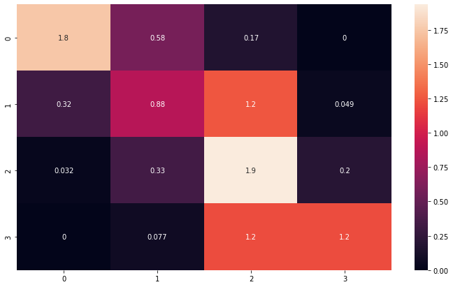
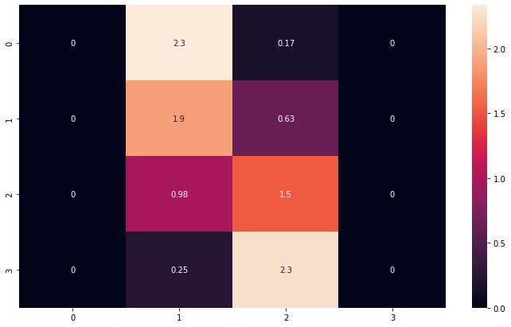
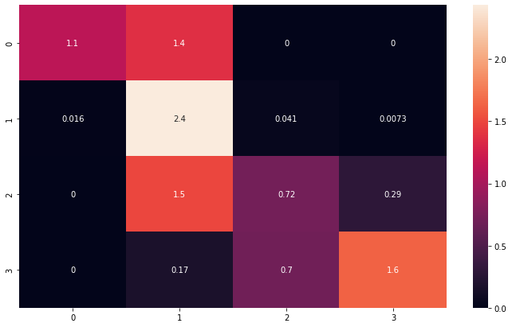
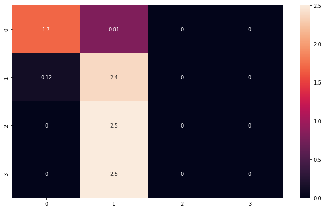
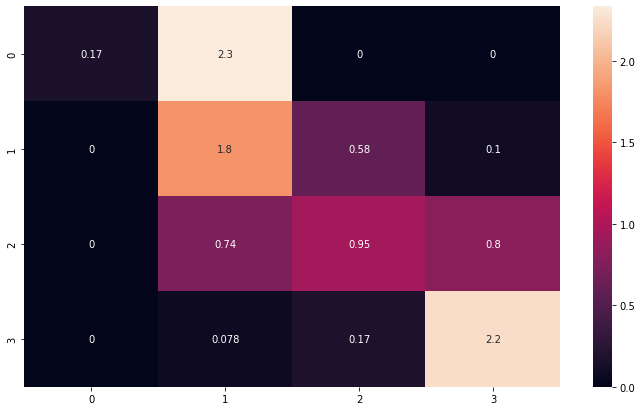
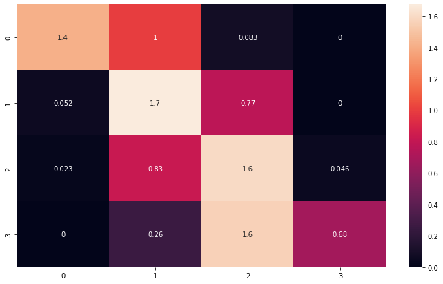

# 두피 상태 예측 AI API

## 수행 목표
 

1.	두피 상태 6종에 대한 학습 데이터셋 생성(상태를 0~3 으로 구별)  

2.	두피 상태 6종의 상태를 target으로 하는 모델 생성(각 종 별로 모델 생성) / 여러 모델을 시험하여 가장 효율적인 모델로 생성  

3.	Flask 를 이용한 API 서버 구축(post image > return result json)  

4.	Vue를 이용한 test page 생성(axios 사용) > 빌드 경로를 flask static folder로 설정  

5.	Docker에 model 및 flask server를 담아 docker hub를 통해 배포

 

## 수행 내용

1. 두피 상태 6종에 대한 학습 데이터셋 생성
   - torch transform 을 통한 augmentation
   - sklearn을 통한 train test split (label 균등)  

2. 두피 상태 6종의 상태를 target으로 하는 모델 생성
   - 시험 모델 종류: VGG / ResNet / Efficient Net / GoogleNet / VIT
   - 각모델의 confusion matrix를 비교하여 최선의 모델을 선정

3. Flask를 이용한 API 서버 구축
   - Post 방식으로 image를 보내면 모든 클래스에 대해서 결과를 json으로 return(/predict_all)
   - Post 방식으로 image 와 value_num 을 보내면 value_num 에 맞는 결과를 json으로 return(/predict)

4. Vue & axios & tailwind 를 이용한 test page
    - axios를 이용하여 POST방식으로 전송하여 API 작동 여부 확인(All Class / Single Class)

5. Docker를 통한 배포
    - 도커를 통해 어느 환경에서도 작동할 수 있게 함
    - docker hub를 통한 이미지 배포

 

## 수행 결과

1. 시험 모델 종류: VGG / ResNet / Efficient Net / GoogleNet / VIT
   * Efficient Net 모델로 선정(NVIDIA/DeepLearningExamples:torchhub / pretrained = True)  
  
2. 모델 학습 결과

   * 위부터 아래로 value_1~6 의 confusion matrix

  

  * value에 따른 class_name

1. Flask 를 이용하여 API 를 구축

    * API document https://documenter.getpostman.com/view/24010364/2s8ZDX4NXT  

4. Vue & axios & tailwind 를 이용한 test_page

1. Docker를 사용한 배포 및 Docker Hub 업로드

    * Docker Hub 주소: https://hub.docker.com/repository/docker/baehanjin/scalp_ai_api/general  

