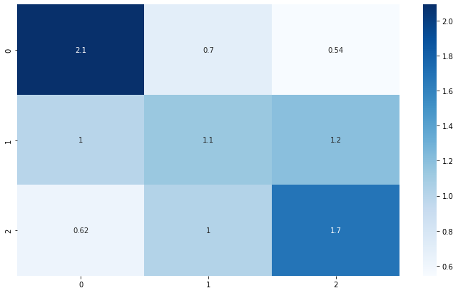
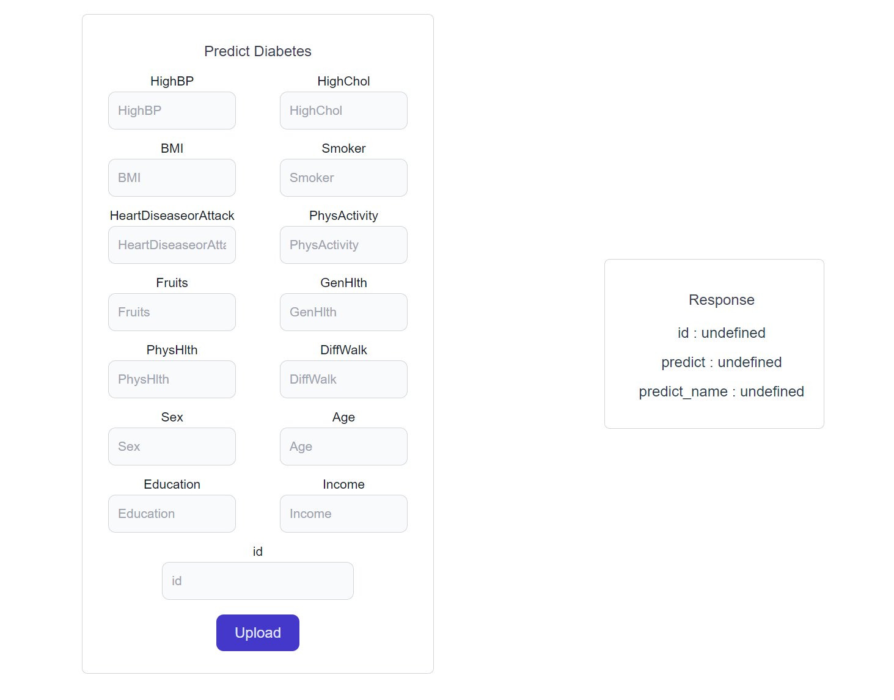
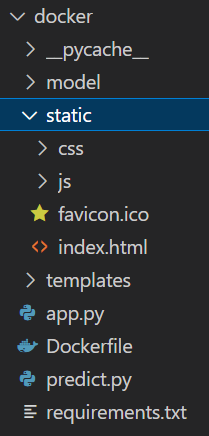
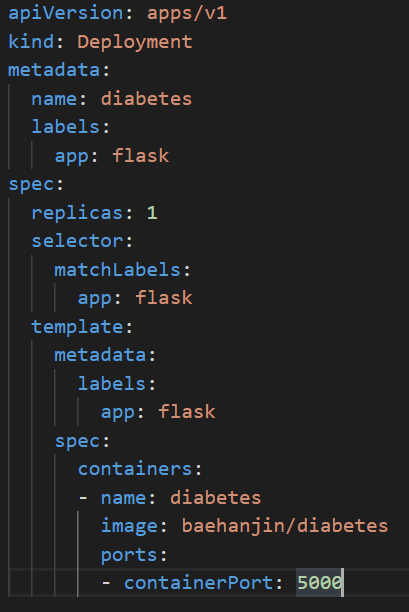
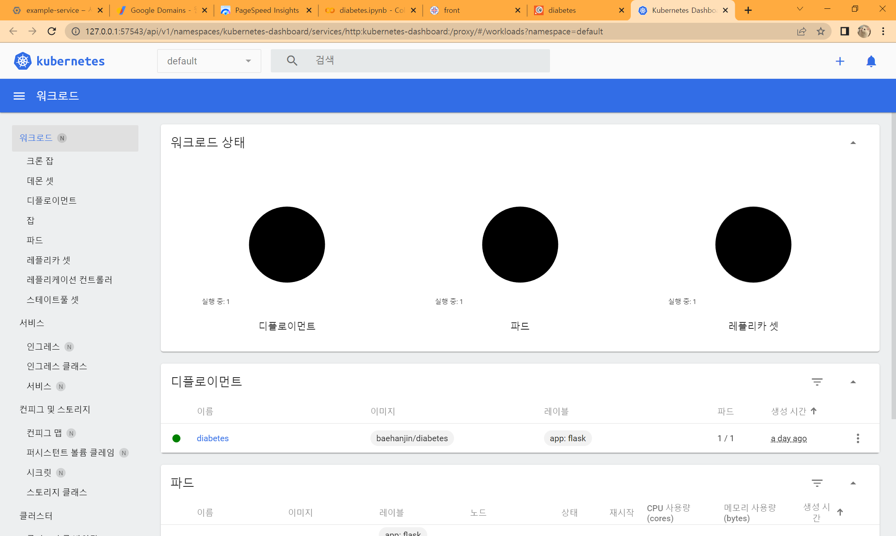
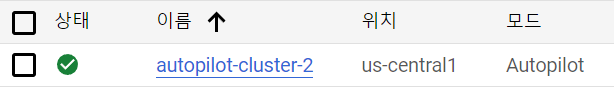
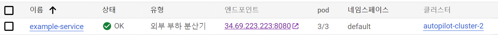
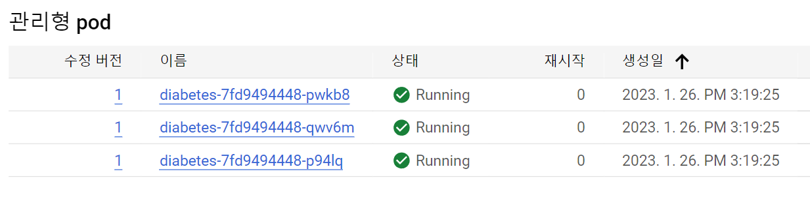

# 당뇨병 자가진단

## 사용 기술 스택  
 

<a/>&nbsp
<a/>&nbsp
<a/>&nbsp
<a/>&nbsp

 <a/>&nbsp
 <a/>&nbsp

 <a/>&nbsp
 <a/>&nbsp
<a/>&nbsp

   

## API

   

* API document 
    [https://documenter.getpostman.com/view/24010364/2s8ZDX4NXT  ](https://documenter.getpostman.com/view/24010364/2s8ZDeTJo5)

* Test Page  
    http://34.69.223.223:8080/
  
   

## Docker Hub  

   

* docker hub 

    https://hub.docker.com/r/baehanjin/diabetes

   

## Dataset

   

* kaggle

    https://www.kaggle.com/datasets/alexteboul/diabetes-health-indicators-dataset

   

## Colab

   

* Colab

    https://colab.research.google.com/drive/1aYRTNwJ-xMNLp-VWHBgaAIaNMrtO3hVu?usp=sharing

   

## 수행 목표
 

1. 당뇨병 데이터셋을 활용하여 당뇨병 예측 모델 구성.

2. 모델을 이용하여 당뇨병 자가진단 API 구성.

3. API를 테스트 해볼 수 있는 페이지 구성.

4. 도커를 이용하여 패키징

5. 쿠버네티스를 이용하여 서비스 관리

6. GKE를 이용하여 배포

 

## 수행 내용  

   

1. 데이터 학습 전에 통계적 분석을 활용하여 필요없는 column을 제거(confusion matrix 활용)

2. 당뇨병 데이터셋을 이용하여 여러 모델을 사용하여 학습. 최종적으로 'no diabetes', 'prediabete', 'diabetes' 을 0,1,2로 구별하여 추출

3. 학습된 모델을 추출하여 flask 를 이용하여 api 구축(predict.py로 분리)

4. api 를 테스트 해볼 수 있는 페이지를 Vue.js 를 이용하여 구성

5. Vue를 빌드하여 flask의 정적 폴더로 사용

6. 구축된 서비스를 docker를 이용하여 패키징

7. minikube를 이용하여 로컬에서 쿠버네티스 테스트

8. GKE(google kubernetes engine)을 활용하여 외부 ip로 배포

9. google DNS 를 이용하여 도메인을 ip와 연결

 

## 수행 결과  

   

1. 데이터 학습 전에 통계적 분석을 활용하여 필요없는 column을 제거(confusion matrix 활용)  

    - CholCheck, Stroke, Veggies, HvyAlcoholConsump, AnyHealthcare, NoDocbcCost, MentHlth 열 제거
    - Colab: Check Data 확인  

  

2. 당뇨병 데이터셋을 이용하여 여러 모델을 사용하여 학습. 최종적으로 'no diabetes', 'prediabete', 'diabetes' 을 0,1,2로 구별하여 추출  

    

    - 모델 학습 결과 Confusion Matrix

  

3. 학습된 모델을 추출하여 flask 를 이용하여 api 구축(predict.py로 분리)  

   - API document 
       [https://documenter.getpostman.com/view/24010364/2s8ZDX4NXT  ](https://documenter.getpostman.com/view/24010364/2s8ZDeTJo5)  

  

4. api 를 테스트 해볼 수 있는 페이지를 Vue.js 를 이용하여 구성  

      

  

5. Vue를 빌드하여 flask의 정적 폴더로 사용

      

  

6. 구축된 서비스를 docker를 이용하여 패키징

      - docker hub 

        https://hub.docker.com/r/baehanjin/diabetes  

  

7. minikube를 이용하여 로컬에서 쿠버네티스 테스트  

    <code> minikube start --extra-config=apiserver.service-node-port-range=5000-5021 </code>

    <em>minikube start</em>

      

    <em>minikube.yaml(deployment)</em>

    <code>kubectl expose deployment diabetes --port=8080 --target-port=5000 \
        --name=example-service --type=LoadBalancer
    </code>  
    <em>export to service</em>

      

    <em>minikube dashboard</em>

    
    

  

8. GKE(google kubernetes engine)을 활용하여 외부 ip로 배포

    
    <em>cluster</em>
    
    <em>service</em>
    
    <em>pod</em>

   - http://34.69.223.223:8080/  

 

9.  google DNS 를 이용하여 도메인을 ip와 연결  

 

## 성과 및 기대효과

 

- 데이터셋이 머신러닝에 적합하지 않아 적용하지는 않았지만 저용량으로 서비스를 구현할 수 있었음.

- Flask를 통해 API 화 시켜 차후 개발자들이 편하게 사용하여 서비스를 구축할 수 있을 것으로 예상

- Docker 형태로 배포하여 환경에 상관없이 구동되는 안정성을 제공함  
  
- Vue 를 사용한 Front 구성은 차후 npm module을 사용하여 프로젝트를 쉽게 확장할 수 있을 것  

- 쿠버네티스를 활용한 서비스 배포를 통해 안정적으로 대규모 서비스를 관리할 수 있을 것

- GCP 제공하는 모니터링을 통해서 알림설정 등 프로메테우스의 역할을 대신할 수 있을 것

